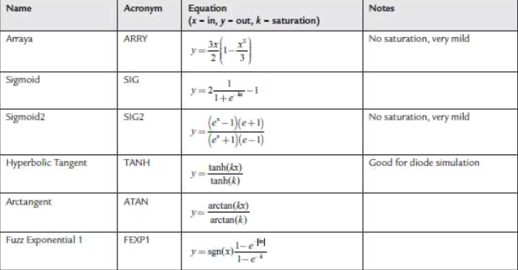
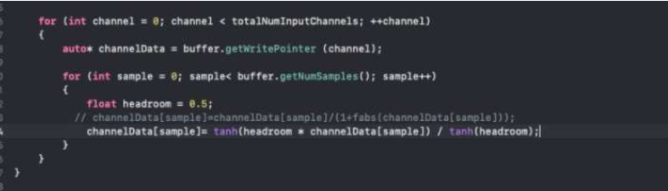
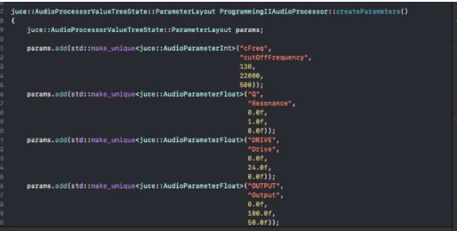
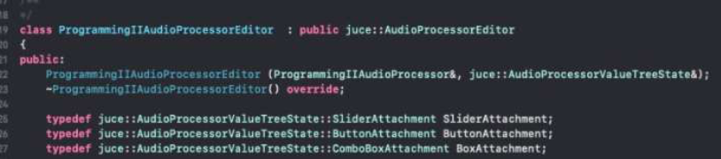
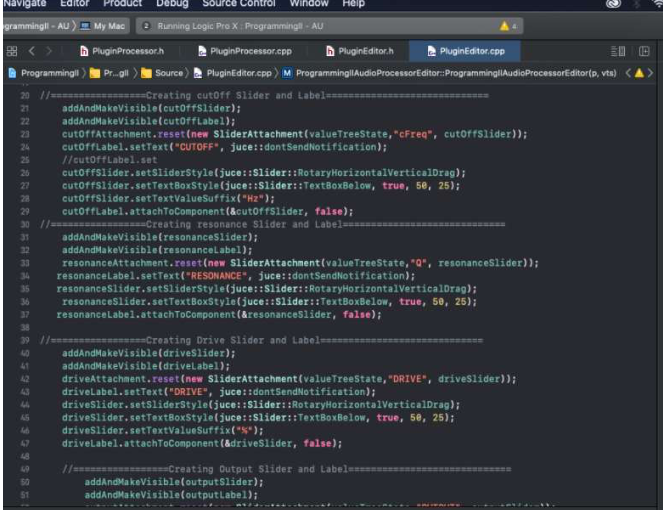
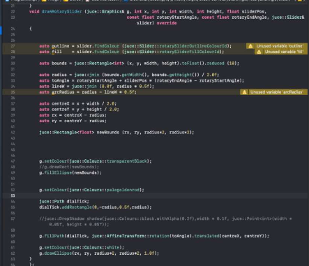

# distortionFilter
<!-- imit -->
## A multiband filter plugin that causes low level distortion with harmonics. Created with [JUCE](https://juce.com/)

<!-- omit -->

## Contents 
<!-- omit -->

## Introduction
The purpose of this task was to create an AU/VST3 plugin using the JUCE library and Projucer application. 
The plugin designed in this report was a distortion filter. Made combining a ladder filter from the JUCE dsp module and some nonlinear processing functions. 

## Method
1. Implementing JUCE dsp ladder filter
2. Adding distortion dsp code
3. Creating Parameters
4. Creating Sliders and customising GUI

## Implimenting Filter
> JUCE::dsp::LadderFilter<float>
 
  
  
There is a lot of precursor work that needs to be done before using the filter from the dsp module. It needs a process spec, and audioBlock and a context replacing object. 
The Process spec is a dsp class that creates an object that can hold information about the audio data that will be processed by the dsp algorithm. 
  
  
  
Dsp objects use the information curated by the spec via the prepare function. 
The final steps in using the dsp algorithms is in creating an audio block and a context object.

  
The audio block behaves as the audiobuffer for the DSP filter and the process context replacing behaves like a buffer write pointer, which replaces the original signal with the processed signal from the filter. 
  
## Adding Distortion (Noninear processing function)
The Hyperbolic tangent function was adapted to create distortion to the samples. 

  

## Creating Parameters
Using the JUCE class audio processor value tree state. A value tree of the plugins parameters were created.

 
Creating this class allows you to link parameters with their sliders in the pluginEditor. The class has slider and button attachments.

  
## GUI Design
After creating and positioning the sliders a user interface class was created to manipulate the look and feel functions for the sliders. A texture was downloaded off of the internet and was used as the background of the plugin.

## Results
The plugin functions on multiple platforms. The pre sets menu would have been a modern addition to the plugin as many plugins today have a selection of presets accessible from the UI of the plugin. The look and feel of the buttons and combo box could have been redesigned to ft the entire aesthetic of the rest of the plugin.

## References 
Antonia, D. (2020) Audio Programming Lecture. [Online] 23rd February 2021. Available from:
https://uh.cloud.panopto.eu/Panopto/Pages/Viewer.aspx?id=690b3a1d-eb97-49e5-8d1a-acd8014712ca [Accessed on 13th May 2021] 
 
Pirkle, W. (2019) Chapter 19: Nonlinear Processing: Distortion, Tube Simulation, and HF Exciters. In: Pirkle, W. Designing Audio Effect Plugins in C++ For AAX, AU, and VST3 with DSP Theory – second Edition. New York: Routledge. 
 
The Audio Programmer (2020) JUCE 6 Tutorial 10 – State Variable Filter and the DSP Module [YouTube] home. Available from: https://www.youtube.com/watch?v=CONdIj- 7rHU&list=PLLgJJsrdwhPyNsICl0_gSGF7owIow_cfA&index=14 [Accessed on: 10th May 2021] 
 
The Audio Programmer (2020) Juce Tutorial 06- Customizing Dials and Sliders Using The Look And Feel Class (Pt 1 of 2) [YouTube] home. Available from: https://www.youtube.com/watch?v=po46y8UKPOY [Accessed on: 10th May 2021] 
 
Juce.com (n.d) JUCE: Tutorial: Customise he look and feel of your app. [Online] Available from: https://docs.juce.com/master/tutorial_look_and_feel_customisation.html [Accessed on 18th May 2021] 
 
Wallpaper.dog (n.d) WallpaperDog-17248257.jpg [Online] Available from: https://wallpaper.dog/black-metal-texture-wallpapers [Accessed on 18th May 2021] 
 
